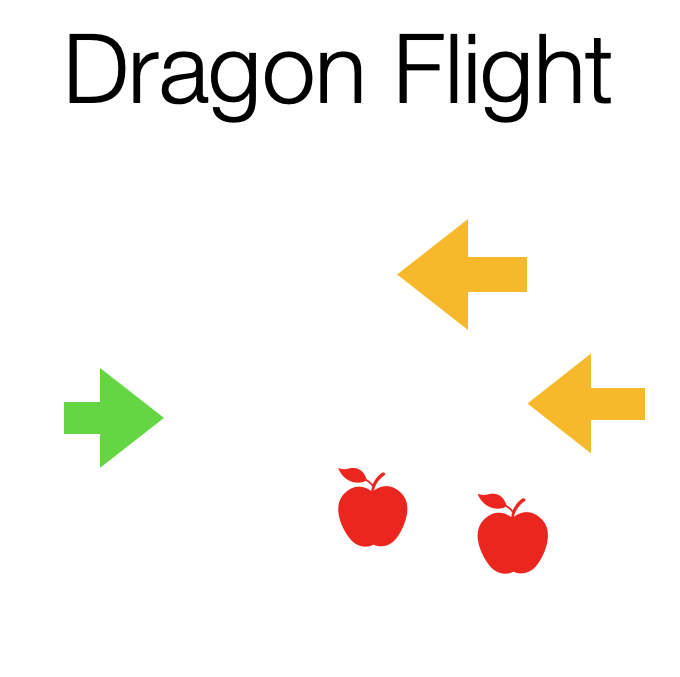

# Dragon Flight

welcome to Dragon Flight!

https://gianlorenzodercole.github.io/dragon_flight/

This is an infinite flight game where the player navigates a dragon around the screen dodging other dragons and collecting food.

If you make it to the end of the flight you win!

# tech stack

I plan to use html canvas

# wireframe

# MVP

+ player should be able to navigate the dragon up and down

+ randomly generated dragons should move from right to left

+ randomly generated food should move from rigth to left

+ detect collision with dragons

+ detect collision with food

+ Notify player when game is over

# Stretch

+ add one point when player collides with food

+ track score

+ style game
